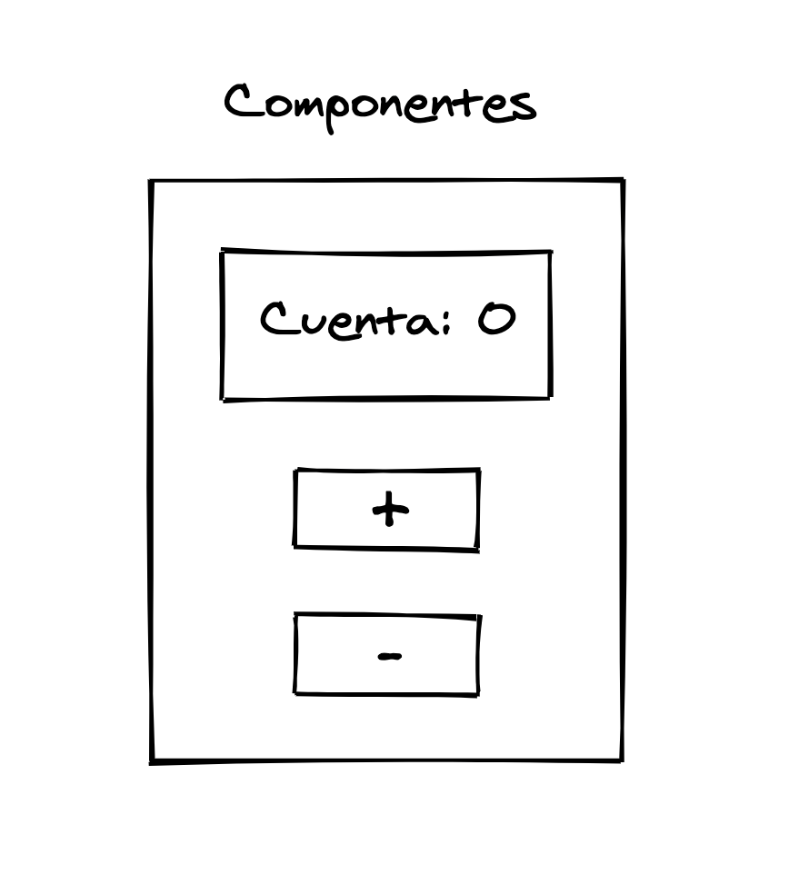

# 3. Composicion

**PDF: páginas 7–10** (libro: 3–6)

---

[← Índice](README.md) | [← Anterior: 2. Requisitos](02-00-requisitos.md) | [Siguiente: 4. Modelo Declarativo →](04-00-modelo-declarativo.md)

---

## Composición

En las aplicaciones hechas con React, todo son componentes. En la programación funcional se
pasan funciones como parámetros para resolver problemas más complejos, y en React se sigue este
mismo patrón para realizar las composiciones de los componentes, donde un componente puede
estar compuesto por otros componentes.

Los componentes son piezas de código que encapsulan un comportamiento, una vista y su estado.
Estas piezas tienen que ser reutilizables de tal forma que un componente se pueda utilizar en
distintas partes de la aplicación.

También tienen que ser autocontenidos, por lo que el comportamiento del componente queda
dentro del componente haciendo que sean más fáciles de mantener.

También deberían de ser fácilmente testeables porque actúan como funciones puras, por lo que

para unos mismos parámetros que reciba el componente tiene que mostrar siempre la misma vista.

Al desarrollar con React, iremos creando componentes sencillos para resolver problemas pequeños,
y estos componentes los iremos uniendo a otros para generar interfaces de usuario más complejas.
Al final la aplicación será un conjunto de componentes que trabajarán entre ellos.

**Figura 1 — Componente card**

**Figura 2 — Composición del componente card**

