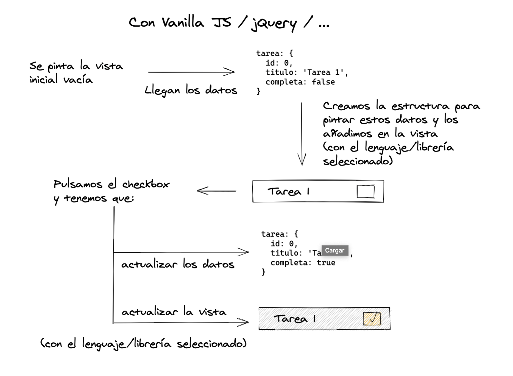
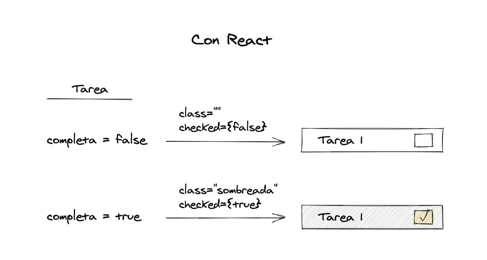
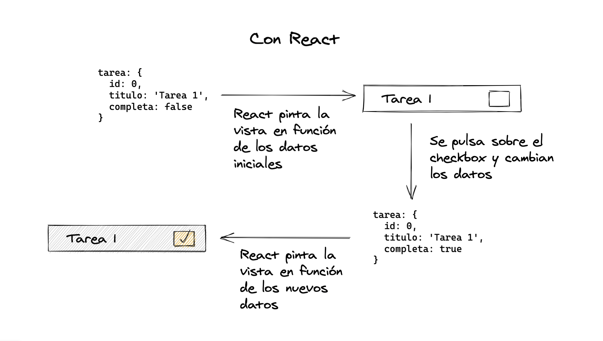

# 6. React Vs Jquery

**PDF: páginas 14–15** (libro: 10–11)

---

[← Índice](README.md) | [← Anterior: 5. Virtual Dom](05-00-virtual-dom.md) | [Siguiente: 7. Create React App →](07-00-create-react-app.md)

---

## React vs jQuery vs …

Entre utilizar React frente a utilizar otras librerías como por ejemplo jQuery, hay una gran
diferencia.

**Figura 3 — Esquema (React vs jQuery)**

**Figura 4 — Esquema (React vs jQuery)**

**Figura 5 — Esquema (React vs jQuery)**

En jQuery u otras somos nosotros quienes tenemos que pintar las etiquetas HTML, añadir los
listeners sobre ellas para poder detectar las acciones que realiza el usuario y así poder ejecutar el
código que va a realizar la modificación de los datos y las modificaciones correspondientes en la
vista.

Mientras que en React, solo tenemos que indicar como tiene que pintar los datos que le llegan, y
nosotros solo tendríamos que preocuparnos por indicarle como cambian los datos.

En el momento en que estos datos cambian, React los renderizará automáticamente sin que
nosotros tengamos que indicarle como los tiene que volver a pintar.